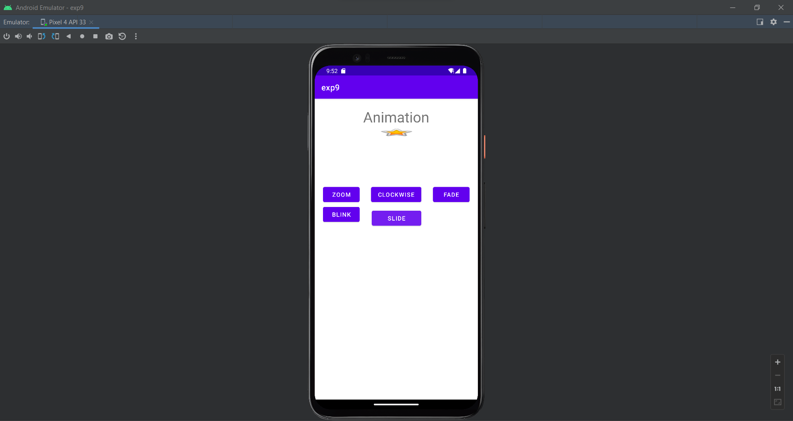

# Ex_No-9_Graphical-Primitives
Design an application that draws basic graphical primitives on the screen.

## AIM:
To create and design an android application that draws basic graphical primitives on the screen using Android Studio.

## EQUIPMENTS REQUIRED:

Android Studio(Min. required Artic Fox)


## ALGORITHM:
Step 1: Open Android Studio and then click on File -> New -> New project.

Step 2: Then type the Application name as SMSIntent and click Next.

Step 3: Select the Minimum SDK below and click Next.

Step 4: Then select the Empty Activity and click Next. Finally, click Finish.

Step 5: Design layout in activity_main.xml.

Step 6: Draw the basic object processed in MainActivity file.

Step 7: Save and run the application.


## Program:
 ```
/*
Program to create and design an android application for draw basic graphical primitives.
Developed by: MADHAN BABU P
RegisterNumber:  212222230075
*/
```

## MainActivity.java:
```
package com.example.exp9;
import androidx.appcompat.app.AppCompatActivity;
import androidx.appcompat.app.AppCompatActivity;
import android.os.Bundle;
import android.os.Bundle;
import android.view.animation.Animation;
import android.view.animation.AnimationUtils;
import android.widget.ImageView;
import android.view.View;
import android.os.Bundle;
public class MainActivity extends AppCompatActivity {
@Override
protected void onCreate(Bundle savedInstanceState) {
super.onCreate(savedInstanceState);
setContentView(R.layout.activity_main);
}
public void clockwise(View view){
ImageView image = (ImageView)findViewById(R.id.imageView);
Animation animation = AnimationUtils.loadAnimation(getApplicationContext(),
R.anim.myanimation);
image.startAnimation(animation);
}
public void zoom(View view){
ImageView image = (ImageView)findViewById(R.id.imageView);
Animation animation1 = AnimationUtils.loadAnimation(getApplicationContext(),
R.anim.clockwise);
image.startAnimation(animation1);
}
public void fade(View view){
ImageView image = (ImageView)findViewById(R.id.imageView);
Animation animation1 =
AnimationUtils.loadAnimation(getApplicationContext(),
R.anim.fade);
image.startAnimation(animation1);
}
public void blink(View view){
ImageView image = (ImageView)findViewById(R.id.imageView);
Animation animation1 =
AnimationUtils.loadAnimation(getApplicationContext(),
R.anim.blink);
image.startAnimation(animation1);
}
activity_main.xml:
public void slide(View view){
ImageView image = (ImageView)findViewById(R.id.imageView);
Animation animation1 =
AnimationUtils.loadAnimation(getApplicationContext(), R.anim.slide);
image.startAnimation(animation1);
}
}
```


## activity_main.xml:
```
public void clockwise(View view){
ImageView image = (ImageView)findViewById(R.id.imageView);
Animation animation = AnimationUtils.loadAnimation(getApplicationContext(),
R.anim.myanimation);
image.startAnimation(animation);
}
public void zoom(View view){
ImageView image = (ImageView)findViewById(R.id.imageView);
Animation animation1 = AnimationUtils.loadAnimation(getApplicationContext(),
R.anim.clockwise);
image.startAnimation(animation1);
}
public void fade(View view){
ImageView image = (ImageView)findViewById(R.id.imageView);
Animation animation1 =
AnimationUtils.loadAnimation(getApplicationContext(),
R.anim.fade);
image.startAnimation(animation1);
}
public void blink(View view){
ImageView image = (ImageView)findViewById(R.id.imageView);
Animation animation1 =
AnimationUtils.loadAnimation(getApplicationContext(),
R.anim.blink);
image.startAnimation(animation1);
}
public void slide(View view){
ImageView image = (ImageView)findViewById(R.id.imageView);
Animation animation1 =
AnimationUtils.loadAnimation(getApplicationContext(), R.anim.slide);
image.startAnimation(animation1);
}
}
```

## AndroidMainfest.xml
```
<?xml version="1.0" encoding="utf-8"?>
<manifest xmlns:android="http://schemas.android.com/apk/res/android"
xmlns:tools="http://schemas.android.com/tools"
package="com.example.exp9">
<application
android:allowBackup="true"
android:dataExtractionRules="@xml/data_extraction_rules"
android:fullBackupContent="@xml/backup_rules"
android:icon="@mipmap/ic_launcher"
android:label="@string/app_name"
android:roundIcon="@mipmap/ic_launcher_round"
android:supportsRtl="true"
android:theme="@style/Theme.Exp9"
tools:targetApi="31">
<meta-data
android:name="com.google.android.actions"
android:resource="@anim/myanimation" />
<activity
android:name=".MainActivity"
android:exported="true">
<intent-filter>
<action android:name="android.intent.action.MAIN" />
<category android:name="android.intent.category.LAUNCHER" />
</intent-filter>
</activity>
</application>
</manifest>
```
## BLINK,xml
```
<?xml version="1.0" encoding="utf-8"?>
<set xmlns:android="http://schemas.android.com/apk/res/android">
<alpha android:fromAlpha="0.0"
android:toAlpha="1.0"
android:interpolator="@android:anim/accelerate_interpolator"
android:duration="500"
android:repeatMode="reverse"
android:repeatCount="infinite"/>
</set>


```

## clock.xml
```
<?xml version="1.0" encoding="utf-8"?>
<set xmlns:android="http://schemas.android.com/apk/res/android">
<rotate xmlns:android="http://schemas.android.com/apk/res/android"
android:fromDegrees="0"
android:toDegrees="360"
android:pivotX="50%"
android:pivotY="50%"
android:duration="5000" >
</rotate>
<rotate xmlns:android="http://schemas.android.com/apk/res/android"
android:startOffset="5000"
android:fromDegrees="360"
android:toDegrees="0"
android:pivotX="50%"
android:pivotY="50%"
android:duration="5000" >
</rotate>
</set>
```

## fade.xml
```
<?xml version="1.0" encoding="utf-8"?>
<set xmlns:android="http://schemas.android.com/apk/res/android">
android:interpolator="@android:anim/accelerate_interpolator">
<alpha
android:duration="1000"
android:fromAlpha="0"
android:toAlpha="1" />
<alpha
android:duration="1000"
android:fromAlpha="1"
android:startOffset="2000"
android:toAlpha="0" />
</set>
```
## my animation.xlm
```
<?xml version="1.0" encoding="utf-8"?>
<set xmlns:android="http://schemas.android.com/apk/res/android">
<scale xmlns:android="http://schemas.android.com/apk/res/android"
android:fromXScale="0.5"
android:toXScale="3.0"
android:fromYScale="0.5"
android:toYScale="3.0"
android:duration="5000"
android:pivotX="50%"
android:pivotY="50%" >
</scale>
<scale xmlns:android="http://schemas.android.com/apk/res/android"
android:startOffset="5000"
android:fromXScale="3.0"
android:toXScale="0.5"
android:fromYScale="3.0"
android:toYScale="0.5"
android:duration="5000"
android:pivotX="50%"
android:pivotY="50%" >
</scale>
</set>
```
## slide.xml
```
<?xml version="1.0" encoding="utf-8"?>
<set xmlns:android="http://schemas.android.com/apk/res/android">
android:fillAfter="true" >
<scale
android:duration="500"
android:fromXScale="1.0"
android:fromYScale="1.0"
android:interpolator="@android:anim/linear_interpolator"
android:toXScale="1.0"
android:toYScale="0.0" />
</set>
```


## zoom.xml
```
<?xml version="1.0" encoding="utf-8"?>
<set xmlns:android="http://schemas.android.com/apk/res/android">
android:fillAfter="true" >
<scale
android:duration="500"
android:fromXScale="1.0"
android:fromYScale="1.0"
android:interpolator="@android:anim/linear_interpolator"
android:toXScale="1.0"
android:toYScale="0.0" />
</set>
```


## Output:





## Result:
Thus a Simple Android Application to create and design an android application that draws basic graphical primitives on the screen using Android Studio was developed and executed successfully.
